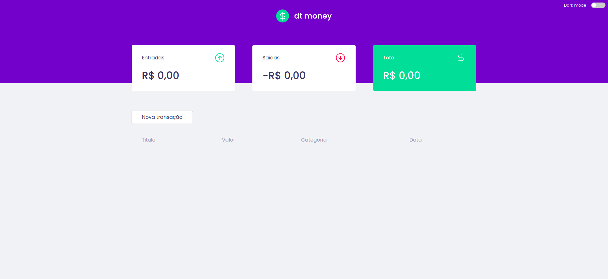
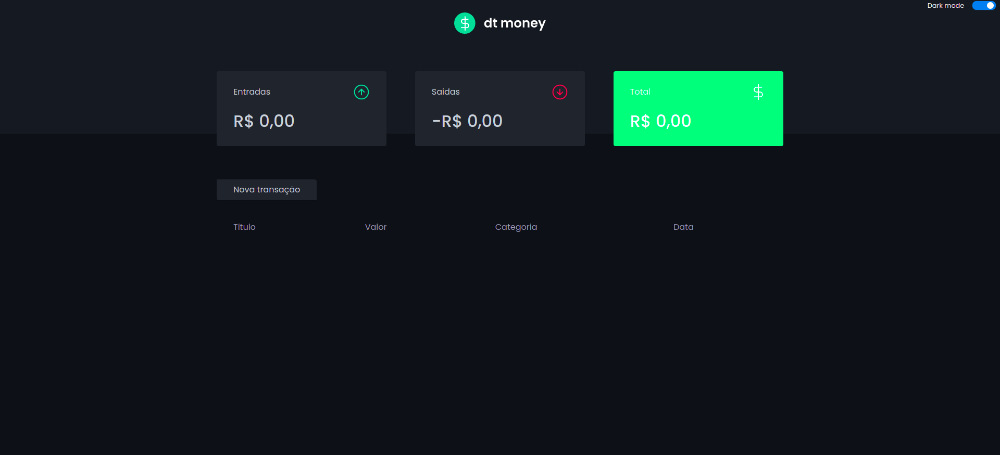

<h1 align="center">
  <strong>DtMoney</strong>
</h1>
<br>

## Sobre o projeto - About the project

Este é um aplicativo front-end desenvolvido durante o curso "Ignite" fornecido pela Rocketseat em react que usa conceitos como Styled Components, Mirage Js, Context API, hooks, axios e muito mais. O app tem um sistema de cadastro de entradas e saidas consegue visualizar a listagem desses cadastros.


Este é um aplicativo front-end desenvolvido durante o curso "Ignite" fornecido pela Rocketseat em react que usa conceitos como Styled Components, Mirage Js, Context API, hooks, axios e muito mais. O app tem um sistema de cadastro de entradas e saidas consegue visualizar a listagem desses cadastros.


<h1 align="center" display="flex">
   
   
</h1>

## Tecnologias - Technologies 

Este projeto foi desenvolvido com as seguintes tecnologias:
<br>
This project was developed with the following technologies:

- [React](https://reactjs.org)
- [TypeScript](https://www.typescriptlang.org/)
- [Styled-components](https://styled-components.com/)
- [MirajeJs](https://miragejs.com/)
  <br>

## Como executar - How to execute
Para iniciá-lo, siga as etapas abaixo:
<br>
To start it, follow the steps below:

```bash
# Instale as dependencias
# Install dependencies
$ yarn

# Inicie o projeto
# start the project
$ yarn start
```
O aplicativo estará disponível em seu navegador no endereço http://localhost:3000.
<br>
The app will be available in your browser at the address http://localhost:3000.


O aplicativo também está disponível na web em produção https://dtmoney-ignite-reactjs.vercel.app/
<br>
The app is also available on the web in production https://dtmoney-ignite-reactjs.vercel.app/

<br>


